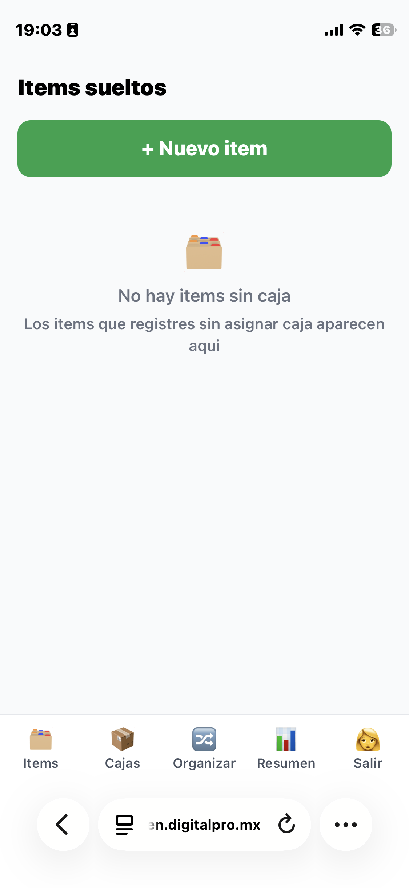
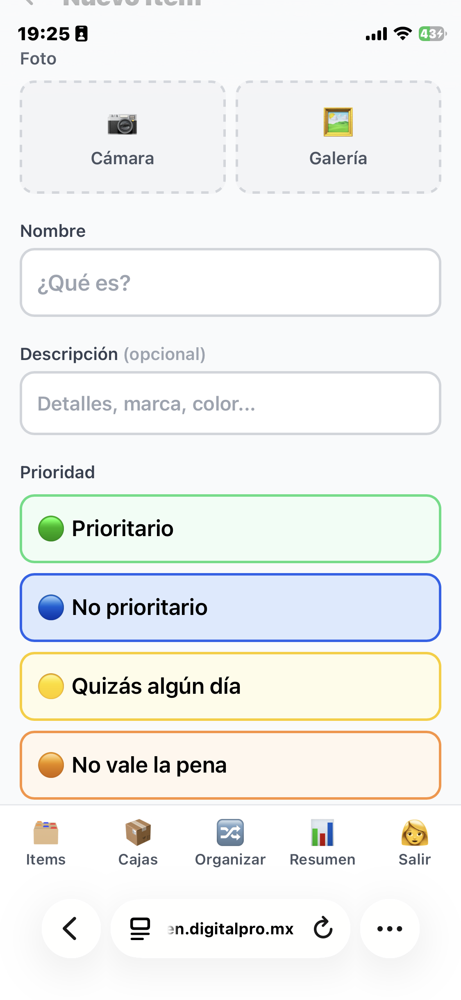
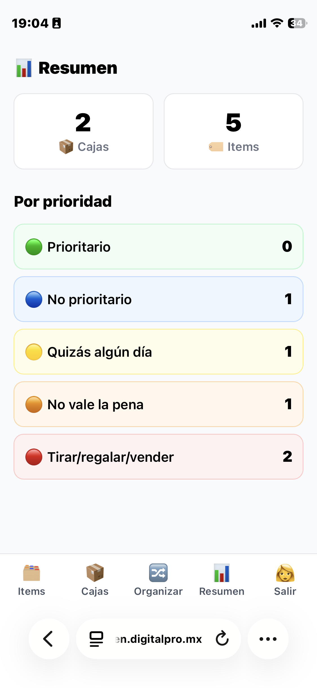

# Inventario Casero

App casera para organizar cajas e items cuando te mudas. Hecha para usarse desde el celular.

Añado esta línea, solo para comentar que este ha sido un proyecto "vibe code" hecho desde el teléfono y con el enfoque de "hacer la maleta".
Sólo cuesta un par de horas de prestar atención y afinar tus preferencias y afinidades, pero si te sirve para ahorrarte unos cuantos tokens, 
adelante, úsalo a tu conveniencia y construye desde él, estaré encantado de ver si alguien lo usa y para qué.

## Capturas de pantalla

<p align="center">
  
  &nbsp;&nbsp;
  
  &nbsp;&nbsp;
  
</p>

## Que hace

- Creas cajas, les pones numero y etiqueta
- Agregas items con foto, nombre y prioridad
- Cada item se clasifica por prioridad de envio (prioritario, no prioritario, quizas, no vale la pena, tirar/regalar/vender)
- Vista "Organizar" con drag-and-drop para mover items entre cajas rapidamente
- Codigos QR por caja para escanear y ver el contenido
- Reporte resumen con conteos y peso total

## Tech stack

- **Backend**: Python + FastAPI
- **Base de datos**: SQLite (via SQLAlchemy)
- **Frontend**: Jinja2 templates + htmx + Tailwind CSS
- **Fotos**: Pillow para redimensionar, HTML5 camera API para captura
- **Auth**: PIN por usuario con cookies firmadas
- **Drag-and-drop**: SortableJS

## Como correrlo

```bash
pip install -r requirements.txt
python seed.py        # Crea la BD y usuarios iniciales
python run.py         # Servidor en puerto 8070
```

Abrir http://localhost:8070 en el navegador.

## Licencia

MIT
